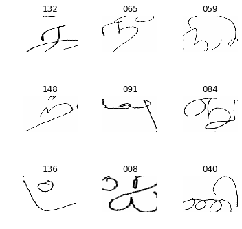
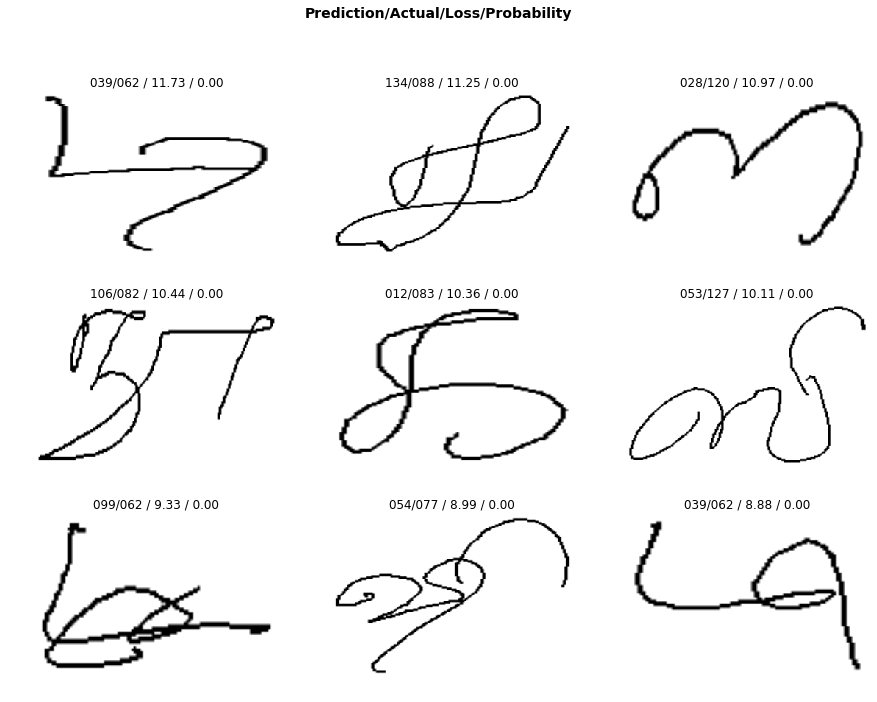
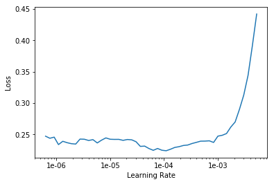

# Ezuthu - Tamil Character Classifier

This notebook will train the model to recognize handwritten tamil characters


```python
%reload_ext autoreload
%autoreload 2
%matplotlib inline
```

We import all the necessary packages. We are going to work with the [fastai V1 library](http://www.fast.ai/2018/10/02/fastai-ai/) which sits on top of [Pytorch 1.0](https://hackernoon.com/pytorch-1-0-468332ba5163). The fastai library provides many useful functions that enable us to quickly and easily build neural networks and train our models.


```python
from fastai.vision import *
from fastai.metrics import error_rate
```

If you're using a computer with an unusually small GPU, you may get an out of memory error when running this notebook. If this happens, click Kernel->Restart, uncomment the 2nd line below to use a smaller *batch size* (you'll learn all about what this means during the course), and try again.


```python
bs = 64
# bs = 16   # uncomment this line if you run out of memory even after clicking Kernel->Restart
```

## Looking at the data

We are going to use the [HPL Handwriting Dataset](http://lipitk.sourceforge.net/hpl-datasets.htm). This dataset contains approximately 500 isolated samples each of 156 Tamil “characters” (details) written by native Tamil writers including school children, university graduates, and adults from the cities of Bangalore, Karnataka, India and Salem, Tamil Nadu, India. The data was collected using HP TabletPCs and is in standard UNIPEN format.

We are going to use the `untar_data` function to which we must pass a URL as an argument and which will download and extract the data.


```python
doc(untar_data)
```


```python
path = Path('data/alpha')
dest = path
dest.mkdir(parents=True, exist_ok=True)
```


```python
path.ls()
```


    [PosixPath('data/alpha/154t05.usr_26.tiff'),
     PosixPath('data/alpha/._041t10.usr_28.tiff'),
     PosixPath('data/alpha/._046t02.usr_144.tiff'),
     PosixPath('data/alpha/._002t06.usr_21.tiff'),
     PosixPath('data/alpha/._132t01.usr_206.tiff'),
     PosixPath('data/alpha/._114t05.usr_21.tiff')
     PosixPath('data/alpha/138t01.usr_122.tiff'),
     PosixPath('data/alpha/139t07.usr_29.tiff'),
     PosixPath('data/alpha/128t09.usr_29.tiff'),
     PosixPath('data/alpha/._029t03.usr_29.tiff'),
     ...]


```python
path_img = path
```

The first thing we do when we approach a problem is to take a look at the data. We _always_ need to understand very well what the problem is and what the data looks like before we can figure out how to solve it. Taking a look at the data means understanding how the data directories are structured, what the labels are and what some sample images look like.

The main difference between the handling of image classification datasets is the way labels are stored. In this particular dataset, labels are stored in the filenames themselves. We will need to extract them to be able to classify the images into the correct categories. Fortunately, the fastai library has a handy function made exactly for this, `ImageDataBunch.from_name_re` gets the labels from the filenames using a [regular expression](https://docs.python.org/3.6/library/re.html).


```python
fnames = get_image_files(path_img)
len(fnames)
```


    64475


```python
np.random.seed(2)
pat = r'/(\d+)t\d+\.usr_\d+.tiff$'
```


```python
tfms = get_transforms(do_flip=False)
data = ImageDataBunch.from_name_re(path_img, fnames, pat, ds_tfms=tfms, size=(224, 336), bs=bs, 
                                  )
```


```python
data.show_batch(rows=3, figsize=(5,5))
```





```python
print(data.classes)
len(data.classes),data.c
```

    ['000', '001', '002', '003', '004', '005', '006', '007', '008', '009', '010', '011', '012', '013', '014', '015', '016', '017', '018', '019', '020', '021', '022', '023', '024', '025', '026', '027', '028', '029', '030', '031', '032', '033', '034', '035', '036', '037', '038', '039', '040', '041', '042', '043', '044', '045', '046', '047', '048', '049', '050', '051', '052', '053', '054', '055', '056', '057', '058', '059', '060', '061', '062', '063', '064', '065', '066', '067', '068', '069', '070', '071', '072', '073', '074', '075', '076', '077', '078', '079', '080', '081', '082', '083', '084', '085', '086', '087', '088', '089', '090', '091', '092', '093', '094', '095', '096', '097', '098', '099', '100', '101', '102', '103', '104', '105', '106', '107', '108', '109', '110', '111', '112', '113', '114', '115', '116', '117', '118', '119', '120', '121', '122', '123', '124', '125', '126', '127', '128', '129', '130', '131', '132', '133', '134', '135', '136', '137', '138', '139', '140', '141', '142', '143', '144', '145', '146', '147', '148', '149', '150', '151', '152', '153', '154', '155']


    (156, 156)


## Training: resnet34

Now we will start training our model. We will use a [convolutional neural network](http://cs231n.github.io/convolutional-networks/) backbone and a fully connected head with a single hidden layer as a classifier. Don't know what these things mean? Not to worry, we will dive deeper in the coming lessons. For the moment you need to know that we are building a model which will take images as input and will output the predicted probability for each of the categories (in this case, it will have 37 outputs).

We will train for 4 epochs (4 cycles through all our data).


```python
learn = cnn_learner(data, models.resnet34, metrics=accuracy)
```


```python
learn.model
```


    Sequential(
      (0): Sequential(
        (0): Conv2d(3, 64, kernel_size=(7, 7), stride=(2, 2), padding=(3, 3), bias=False)
        (1): BatchNorm2d(64, eps=1e-05, momentum=0.1, affine=True, track_running_stats=True)
        (2): ReLU(inplace=True)
        (3): MaxPool2d(kernel_size=3, stride=2, padding=1, dilation=1, ceil_mode=False)
        (4): Sequential(
          (0): BasicBlock(
            (conv1): Conv2d(64, 64, kernel_size=(3, 3), stride=(1, 1), padding=(1, 1), bias=False)
            (bn1): BatchNorm2d(64, eps=1e-05, momentum=0.1, affine=True, track_running_stats=True)
            (relu): ReLU(inplace=True)
            (conv2): Conv2d(64, 64, kernel_size=(3, 3), stride=(1, 1), padding=(1, 1), bias=False)
            (bn2): BatchNorm2d(64, eps=1e-05, momentum=0.1, affine=True, track_running_stats=True)
          )
          (1): BasicBlock(
            (conv1): Conv2d(64, 64, kernel_size=(3, 3), stride=(1, 1), padding=(1, 1), bias=False)
            (bn1): BatchNorm2d(64, eps=1e-05, momentum=0.1, affine=True, track_running_stats=True)
            (relu): ReLU(inplace=True)
            (conv2): Conv2d(64, 64, kernel_size=(3, 3), stride=(1, 1), padding=(1, 1), bias=False)
            (bn2): BatchNorm2d(64, eps=1e-05, momentum=0.1, affine=True, track_running_stats=True)
          )
          (2): BasicBlock(
            (conv1): Conv2d(64, 64, kernel_size=(3, 3), stride=(1, 1), padding=(1, 1), bias=False)
            (bn1): BatchNorm2d(64, eps=1e-05, momentum=0.1, affine=True, track_running_stats=True)
            (relu): ReLU(inplace=True)
            (conv2): Conv2d(64, 64, kernel_size=(3, 3), stride=(1, 1), padding=(1, 1), bias=False)
            (bn2): BatchNorm2d(64, eps=1e-05, momentum=0.1, affine=True, track_running_stats=True)
          )
        )
        (5): Sequential(
          (0): BasicBlock(
            (conv1): Conv2d(64, 128, kernel_size=(3, 3), stride=(2, 2), padding=(1, 1), bias=False)
            (bn1): BatchNorm2d(128, eps=1e-05, momentum=0.1, affine=True, track_running_stats=True)
            (relu): ReLU(inplace=True)
            (conv2): Conv2d(128, 128, kernel_size=(3, 3), stride=(1, 1), padding=(1, 1), bias=False)
            (bn2): BatchNorm2d(128, eps=1e-05, momentum=0.1, affine=True, track_running_stats=True)
            (downsample): Sequential(
              (0): Conv2d(64, 128, kernel_size=(1, 1), stride=(2, 2), bias=False)
              (1): BatchNorm2d(128, eps=1e-05, momentum=0.1, affine=True, track_running_stats=True)
            )
          )...
    )


```python
learn.fit_one_cycle(4)
```


<table border="1" class="dataframe">
  <thead>
    <tr style="text-align: left;">
      <th>epoch</th>
      <th>train_loss</th>
      <th>valid_loss</th>
      <th>accuracy</th>
      <th>time</th>
    </tr>
  </thead>
  <tbody>
    <tr>
      <td>0</td>
      <td>1.417754</td>
      <td>0.704353</td>
      <td>0.784800</td>
      <td>03:54</td>
    </tr>
    <tr>
      <td>1</td>
      <td>0.781108</td>
      <td>0.362233</td>
      <td>0.884219</td>
      <td>03:52</td>
    </tr>
    <tr>
      <td>2</td>
      <td>0.528926</td>
      <td>0.260373</td>
      <td>0.917565</td>
      <td>03:52</td>
    </tr>
    <tr>
      <td>3</td>
      <td>0.483618</td>
      <td>0.233310</td>
      <td>0.927181</td>
      <td>03:52</td>
    </tr>
  </tbody>
</table>


```python
learn.load('stage-1')
```


    Learner(data=ImageDataBunch;
    
    Train: LabelList (51580 items)
    x: ImageList
    Image (3, 224, 336),Image (3, 224, 336),Image (3, 224, 336),Image (3, 224, 336),Image (3, 224, 336)
    y: CategoryList
    070,072,037,110,144
    Path: data/alpha;
    
    Valid: LabelList (12895 items)
    x: ImageList
    Image (3, 224, 336),Image (3, 224, 336),Image (3, 224, 336),Image (3, 224, 336),Image (3, 224, 336)
    y: CategoryList
    076,055,073,048,110
    Path: data/alpha;...
      (2): Flatten()
      (3): BatchNorm1d(1024, eps=1e-05, momentum=0.1, affine=True, track_running_stats=True)
      (4): Dropout(p=0.25, inplace=False)
      (5): Linear(in_features=1024, out_features=512, bias=True)
      (6): ReLU(inplace=True)
      (7): BatchNorm1d(512, eps=1e-05, momentum=0.1, affine=True, track_running_stats=True)
      (8): Dropout(p=0.5, inplace=False)
      (9): Linear(in_features=512, out_features=156, bias=True)
    )], add_time=True, silent=False)


## Results

Let's see what results we have got. 

We will first see which were the categories that the model most confused with one another. We will try to see if what the model predicted was reasonable or not. In this case the mistakes look reasonable (none of the mistakes seems obviously naive). This is an indicator that our classifier is working correctly. 

Furthermore, when we plot the confusion matrix, we can see that the distribution is heavily skewed: the model makes the same mistakes over and over again but it rarely confuses other categories. This suggests that it just finds it difficult to distinguish some specific categories between each other; this is normal behaviour.


```python
interp = ClassificationInterpretation.from_learner(learn)

losses,idxs = interp.top_losses()

len(data.valid_ds)==len(losses)==len(idxs)
```


    True


```python
interp.plot_top_losses(9, figsize=(15,11))
```

    Clipping input data to the valid range for imshow with RGB data ([0..1] for floats or [0..255] for integers).





```python
doc(interp.plot_top_losses)
```


```python
interp.plot_confusion_matrix(figsize=(12,12), dpi=60)
```


```python
interp.most_confused(min_val=2)
```


    [('009', '010', 15),
     ('010', '009', 11),
     ('007', '006', 4),
     ('001', '000', 3),
     ('007', '009', 2),
     ('007', '010', 2)]


## Unfreezing, fine-tuning, and learning rates

Since our model is working as we expect it to, we will *unfreeze* our model and train some more.


```python
learn.unfreeze()
```


```python
learn.fit_one_cycle(1)
```


<table border="1" class="dataframe">
  <thead>
    <tr style="text-align: left;">
      <th>epoch</th>
      <th>train_loss</th>
      <th>valid_loss</th>
      <th>accuracy</th>
      <th>time</th>
    </tr>
  </thead>
  <tbody>
    <tr>
      <td>0</td>
      <td>0.257163</td>
      <td>0.146877</td>
      <td>0.953625</td>
      <td>05:13</td>
    </tr>
  </tbody>
</table>


```python
learn.load('stage-1');
```


```python
learn.lr_find()
```


    <div>
        <style>
            /* Turns off some styling */
            progress {
                /* gets rid of default border in Firefox and Opera. */
                border: none;
                /* Needs to be in here for Safari polyfill so background images work as expected. */
                background-size: auto;
            }
            .progress-bar-interrupted, .progress-bar-interrupted::-webkit-progress-bar {
                background: #F44336;
            }
        </style>
      <progress value='0' class='' max='1', style='width:300px; height:20px; vertical-align: middle;'></progress>
      0.00% [0/1 00:00<00:00]
    </div>

<table border="1" class="dataframe">
  <thead>
    <tr style="text-align: left;">
      <th>epoch</th>
      <th>train_loss</th>
      <th>valid_loss</th>
      <th>accuracy</th>
      <th>time</th>
    </tr>
  </thead>
  <tbody>
  </tbody>
</table><p>

    <div>
        <style>
            /* Turns off some styling */
            progress {
                /* gets rid of default border in Firefox and Opera. */
                border: none;
                /* Needs to be in here for Safari polyfill so background images work as expected. */
                background-size: auto;
            }
            .progress-bar-interrupted, .progress-bar-interrupted::-webkit-progress-bar {
                background: #F44336;
            }
        </style>
      <progress value='64' class='' max='805', style='width:300px; height:20px; vertical-align: middle;'></progress>
      7.95% [64/805 00:24<04:39 0.8169]
    </div>


    LR Finder is complete, type {learner_name}.recorder.plot() to see the graph.


```python
learn.recorder.plot()
```





```python
learn.unfreeze()
learn.fit_one_cycle(2, max_lr=slice(1e-04,1e-03))
```


<table border="1" class="dataframe">
  <thead>
    <tr style="text-align: left;">
      <th>epoch</th>
      <th>train_loss</th>
      <th>valid_loss</th>
      <th>accuracy</th>
      <th>time</th>
    </tr>
  </thead>
  <tbody>
    <tr>
      <td>0</td>
      <td>0.185089</td>
      <td>0.424872</td>
      <td>0.871667</td>
      <td>00:13</td>
    </tr>
    <tr>
      <td>1</td>
      <td>0.139584</td>
      <td>0.144461</td>
      <td>0.966667</td>
      <td>00:13</td>
    </tr>
  </tbody>
</table>


```python
learn.path

from shutil import copyfile
copyfile(learn.path/'export.pkl', 'data/e.pkl')
```


    'data/e.pkl'


That's a pretty accurate model!
